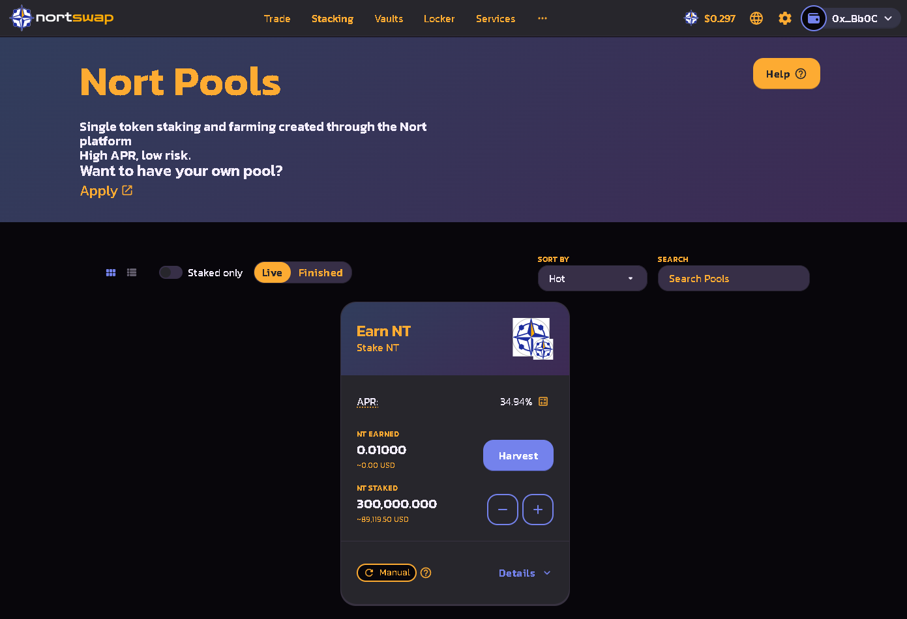
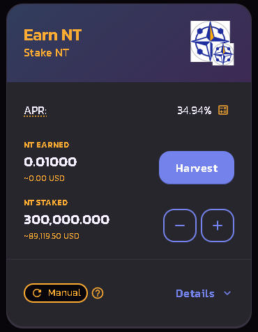
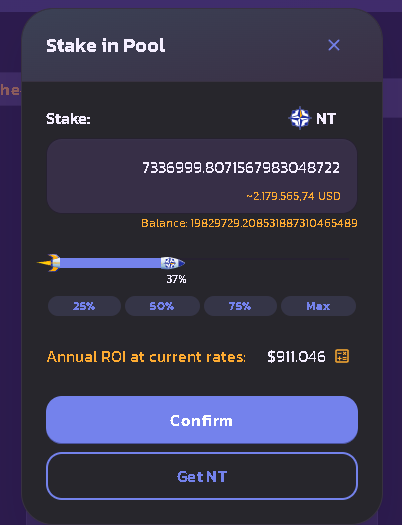
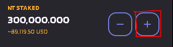
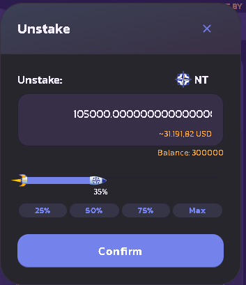

# How to Stake in Nort Pools

taking in [Nort Pools](https://docs.nortswap.finance/products/syrup-pool) lets you earn NT or other tokens while you sleep!

It's simpler than farming with Nortswap's Yield Farms, because unlike the Farms, you only need to stake **one token** to start earning: usually NT.

## **Getting started with Syrup Pool staking**

1\. Go to the Pools page [here](https://nortswap.finance/pools).

2\. Connect to your Binance Smart Chain-compatible wallet by clicking the **Connect** button (top right-hand side).

3\. Click **Unlock Wallet**.

4\. Choose which Syrup Pool you want to stake in.

**Manual NT** doesn’t automatically compound. You’ll need to harvest and compound your earnings manually.

Other Nort Pools let you stake your NT to earn dozens of other cool tokens. Make sure you check them out.\\

***

5\. Once you choose a pool, click the **Enable** button. Your wallet will ask you to confirm the action.

6\. The Enable button should now be replaced with **Stake**. Click the button to bring up the staking menu.

.png>)

7\. Type in an amount or slide the rocket to choose how much NT you want to stake.

8\. Click **Confirm**. Your wallet will ask you to confirm the action.

 (1).png>)

9\. The Confirm button will change to\*\* "\*\*Confirming", then once the transaction is successful, you’ll see your staked amount change and the button will change again.

10\. You should now be able to see details on your Nort Pool. Auto NT will show a countdown until the unstaking fee ends. The other pools will show a **Collect** button to claim your staking rewards into your wallet.

### **Adding and removing NT from a pool** \*\*\*\*

You can easily add more NT to a Nort Pool, or move some NT to a more profitable pool. Here’s how you can move your staked NT.

1\. Click the **-** to take some NT out of a pool, or the **+** to add more to the pool.

2\. A window will open. If you clicked the **+**, choose the amount you would like to add to the pool. If you clicked the **-**, choose the amount to take out of the pool.

3\. Click **Confirm**.

4\. After a little wait, you'll be able to see your new amount of staked tokens.

